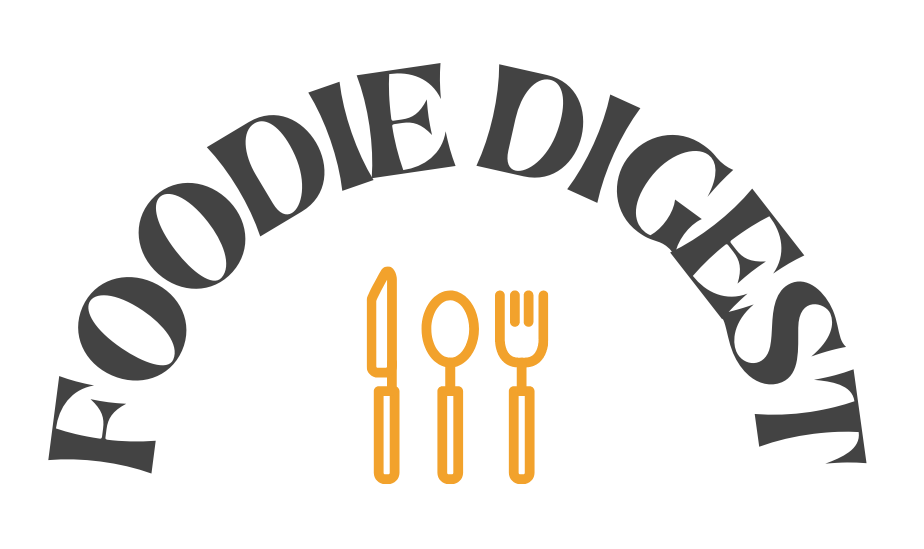

# Foodie Digest 
This application hopes to facilitate the daily struggle of decided what to make for dinner. The website allows for client to search up food recipes based on ingredients they have on hand. 

## Table of Contents:
  * [Search](#search)
  * [Recipes](#recipes)
  * [Favorites](#favorites)
  * [Spoonacular API](#spoonacular)
  * [Licence](#license)
  * [Questions](#questions)
 

### Search

This application allows for the client to search for recipes by ingredients.  This helps client to choose a recipe based on the ingredients they have available. The search could help clients prioritize ingredients that are best served fresh or have a short pantry life. 

 

### Recipes

Recipes are displayed in a simple and understandable format. Ingredients are displayed in a list clearly at the left and readily accessible for client to prep. Instructions are displayed in a numbered list to help client keep track of their progress each step of the process.
 

### Favorites

Clients that have an account have the ability to save recipes that they liked or would like to use in the future. They do so by clicking the save recipe button in the full recipe display page.

Client then can look at their saved recipes by navigating to the favorites page located in the nav. Clients must have a 

 

### Spoonacular

The Spoonacular API was the source for all of our searches and recipes. They have a rich library of recipes and each recipe has a great deal of information about them. Extensive parsing of the data was necessary to get the clear and concise recipe layout presented to clients.

 

### Contributors
 

#### Scott Wilrich 
* swillrich@gmail.com
* [GitHub](https://github.com/swillrich5)

### Jenna Garrison
* jenna4285@yahoo.com
* [GitHub](https://github.com/jenna4285)

### Jennifer Trevizo
* jenny.trevizo2013@gmail.com
* [GitHub](https://github.com/jtrevz)

### Joseph Greenwell
* joeygreenwell@ymail.com
* [GitHub](https://github.com/Jgreenwell93)

 

### License
[Licences](https://opensource.org/licenses/MIT)
 

### Questions
Any questions us? Message us on Github or email us at the addresses provided above! Happy cooking!
